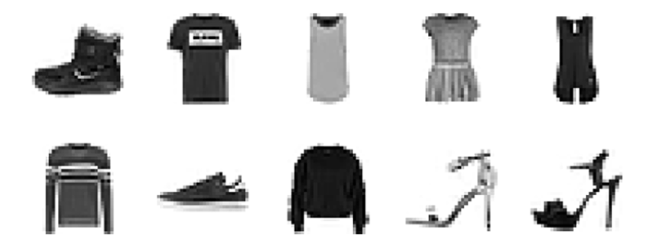
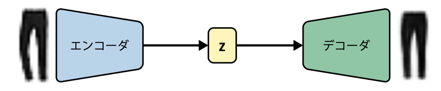
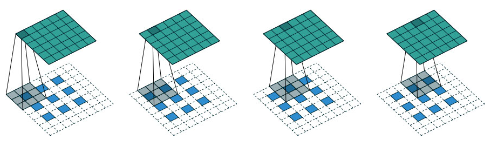
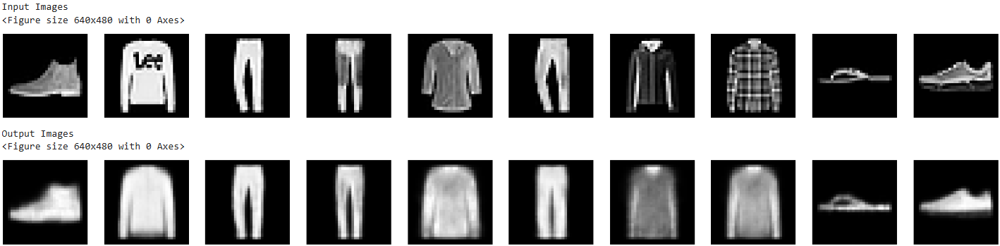
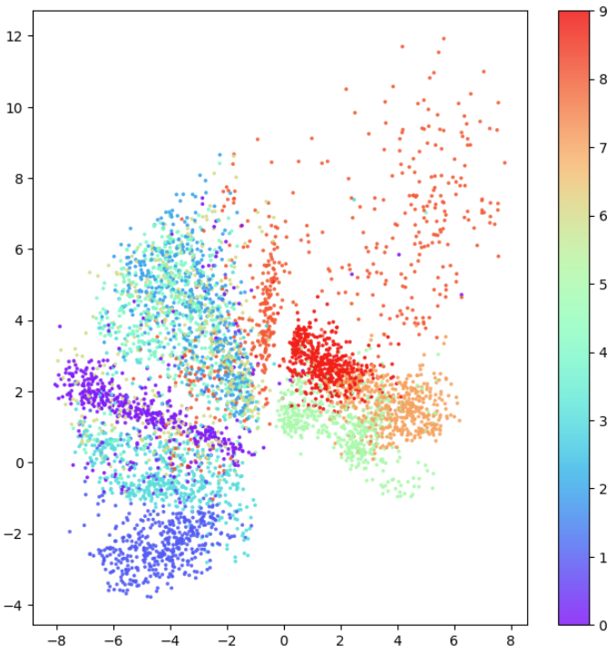
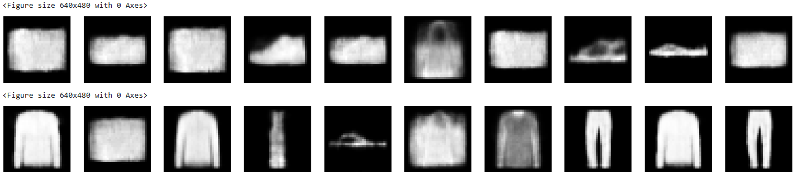
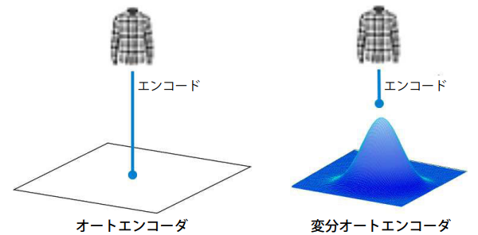
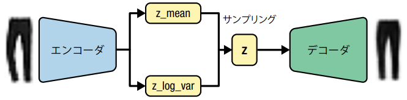

# 第３章 変分オートエンコーダ
**変分オートエンコーダ (Variational Autoencoder: VAE)** は、2013年に提案 [1] された生成モデリングとして最も基本的でよく知られたニューラルネットワークモデル。
本章では、変分オートエンコーダのアーキテクチャ理解と実装を目標とする。

[1] Diederik P. Kingma and Max Welling, "Auto-Encoding Variational Bayes," December 20, 2013, https://arxiv.org/abs/1312.6114

## 3.1 イントロダクション
(「Brian と裁縫と無限ワードローブ」の物語)

## 3.2 オートエンコーダ
### 3.2.1 Fashion-MNIST データセット
28x28 ピクセルのグレースケール衣類画像のコレクション。
ここでは、ニューラルネットワークで扱いやすいように 32x32 ピクセルにパディングしてから利用する。

<div align="center">
    
</div>

### 3.2.2 オートエンコーダのアーキテクチャ
オートエンコーダは **エンコーダ (encoder)** と **デコーダ (decoder)** で構成される。

- エンコーダ: 高次元の入力データを低次元のベクトル (**埋め込み**) に圧縮
- デコーダ: 与えられたベクトルから元の領域のデータを再構成

エンコーダの出力する埋め込みが属する空間を **埋め込み空間** (または **潜在空間**) と呼ぶ。
入力データはエンコーダによって埋め込み空間内のベクトル (**埋め込みベクトル**) ```z``` に圧縮され、デコーダによって埋め込みベクトル ```z``` から元の入力データが復元される。

<div align="center">
    
</div>

デコーダは埋め込み空間のある点からエンコーダの入力データと同じものを生成する方法を学習しているので、デコーダに埋め込み空間内の任意の点を与えることで、入力データと同種の新しいデータを生成できる。

(※ オートエンコーダは、もともとデータ圧縮やノイズ除去に向けたモデルとして研究されていた)

### 3.2.3 エンコーダ
Fashion-MNIST データセットを使って、画像の生成を行うオートエンコーダを実装する。
まずは、以下のようなエンコーダを実装する。

| 層 | 出力形状 | パラメータ数 |
| :--: | :--: | :--: |
| InputLayer | (None, 32, 32, 1) | 0 |
| Conv2D | (None, 16, 16, 32) | 320 |
| Conv2D | (None, 8, 8, 64) | 18,496 |
| Conv2D | (None, 4, 4, 128) | 73,856 |
| Flatten | (None, 2048) | 0 |
| Dense | (None, 2) | 4,096 |

入力された画像から、3層の畳み込み層 (Conv2D) を通して特徴抽出を行う。
それぞれの畳み込み層は stride が 2 の $3 \times 3$ 畳み込みで、層が進むごとにチャネル数が増えるように設計されている。
最後の畳み込み層の出力は Flatten 層でベクトルに変換した後、Dense 層で2次元に圧縮する。

### 3.2.4 デコーダ
次にデコーダを実装する。
基本的にはエンコーダと対象となるような構成になっており、畳み込み層の代わりに転置畳み込み層 (Conv2DTranspose) が使われている。

| 層 | 出力形状 | パラメータ数 |
| :--: | :--: | :--: |
| InputLayer | (None, 2) | 0 |
| Dense | (None, 2048) | 6144 |
| Reshape | (None, 4, 4, 128) | 0 |
| Conv2DTranspose | (None, 8, 8, 128) | 147,584 |
| Conv2DTranspose | (None, 16, 16, 64) | 73,792 |
| Conv2DTranspose | (None, 32, 32, 32) | 18,464 |
| Conv2D | (None, 32, 32, 1) | 289 |

転置畳み込みは、通常の畳み込み層とは逆に、stride が 2 の場合には $3 \times 3$ のカーネル (灰色) が $3 \times 3$ の特徴マップ (青) から $6 \times 6$ の特徴マップ (緑) を生成する。

<div align="center">
    
</div>

### 3.2.5 エンコーダとデコーダの連結
ここまでで定義したエンコーダとデコーダを Keras の ```Model``` クラスを使って連結し、一連のネットワークとして学習、推論ができるようにする。
学習時の損失関数には、入力画像と出力画像の平均二乗誤差 (Root Mean Squared Error: RMSE) か2値交差エントロピー (Binary Cross Entropy: BCE) のいずれかを用いる。
それぞれの損失関数は、入力画像のあるピクセルの値 $y_i$ と、出力画像のピクセル値 $\hat{y}_i$ を用いて、以下のように表される。
ただし、$N$ は画像のピクセル数

- 平均二乗誤差：$RMSE = \sqrt{\frac{1}{N}\sum^N_{i=1}(y_i - \hat{y}_i)^2}$  
  正解のピクセル値に対して対称に誤差が生じる。2値交差エントロピーを用いた場合よりもシャープな画像を生成できる。
- 2値交差エントロピー：$BCE = -\sum^N_{i=1} \Big(y_i \log \hat{y}_i + (1 - y_i) \log (1 - \hat{y}_i) \Big)$  
  正解のピクセル値に対して 0.5 に近い方の値が予測された場合に誤差が小さくなる。平均二乗誤差を用いた場合よりも、ややぼやけた画像が生成される。

### 3.2.6 画像を再構成する
テスト画像を用いて、オートエンコーダで画像の再構成を施行してみる。
埋め込みベクトルが2次元と低次元であるため、ロゴや柄といった元の画像の詳細な部分が再構成できていない。

<div align="center">
    
</div>

### 3.2.7 潜在空間を可視化する
テスト画像をエンコーダに通して得られる埋め込みを2次元平面乗にプロットし、クラスごとに色付けした図を以下に示す。
同じクラスの画像は、潜在空間乗の近くの点に写像されていることが分かる。

<div align="center">
    
</div>

### 3.2.8 新しい画像の生成
潜在空間内の適当な点をいくつかサンプリングして画像を生成する。
選択する点によって、本物らしい画像が生成できたりできなかったりする。

<div align="center">
    
</div>

具体的には、潜在空間内の点の分布には以下のような特徴がある。

- クラスによって埋め込みベクトルの分布が広いものもあれば狭いものもある  
  → 潜在空間上の点をランダムにサンプリングすると、クラスごとにサンプリングされる確率が異なる
- 分布が原点に対して対称ではなく、有界でもない  
  → サンプリング方法が自明ではなくなるため、サンプリングが非常に難しい
- 点をほとんど含まない大きな領域がある  
  → その点から認識可能な画像がデコードされる保証がない

このような特徴のため、デーコーダが常に満足な画像を生成できるとは限らない。
これらの問題を解決する手法として、変分オートエンコーダが提案されている。

## 3.3 変分オートエンコーダ
オートエンコーダの抱える問題を解決するために、変分オートエンコーダはエンコーダと損失関数に変更を加える。

### 3.3.1 エンコーダ
オートエンコーダでは、入力は潜在空間上の1点に写像される。
一方、変分オートエンコーダでは、入力を潜在空間内のある点周辺における多変量正規分布に写像される。

<div align="center">
    
</div>

$k$ 次元の多変量正規分布 $f(\bold{x})$ は、平均ベクトル $\bold{\mu}$、分散共分散行列 $\Sigma$ を用いて、次のように表される。

$$
f(\bold{x}) = \frac{1}{\sqrt{(2\pi)^k |\Sigma|}}\exp\Bigg(\frac{1}{2}(\bold{x} - \bold{\mu})^T \Sigma^{-1} (\bold{x} - \bold{\mu})\Bigg)
$$

ここで、分散は常に正であるため、その対数に写像することで $(-\infty, \infty)$ の実数を取れるようにする。
すなわち、入力データを分布の平均 ```z_mean``` と各次元の分散の対数 ```z_log_var``` の2つのベクトルにエンコードする。
デコーダには、以下の式でランダムにサンプリングした潜在空間上の点を入力する。(ただし、$N(0,I)$ は標準正規分布)

$$
z = z\_mean + z\_sigma * epsilon \\
z\_sigma = exp(z\_log\_var * 0.5) \\
epsilon ～ N(0,I) \\
$$

よって、変分オートエンコーダのアーキテクチャは以下のようになる。

<div align="center">
    
</div>

オートエンコーダでは、精度高くデータを生成できた潜在空間上の点の近傍からサンプリングをしたとしても、同様に高精度な生成が可能であるとは限らない。
しかし、変分オートエンコーダではランダムにサンプリングした点においても、入力に近いデータを再構成することを求められるため、潜在空間上の任意の点から高精度にデータを生成することができる。

### 3.3.2 損失関数
変分オートエンコーダの学習では、```z_mean``` と ```z_log_var``` の与える正規分布が、標準正規分布に近づくように学習する。
これを実現するため、損失関数としてオートエンコーダで使用した再構成誤差に加えて、**KL 情報量** (Kullback-Leibler divergence: カルバック・ライブラー情報量) を用いる。
2つの確率分布 $p(x)$ と $q(x)$ の KL 情報量の一般形は以下の式で与えられる。

$$
D_{KL}\big[p(x) || q(x) \big] = \sum_i p(x_i) \cdot \big( \log p(x_i) - \log q(x_i) \big)
$$

平均 $\mu$、分散 $\sigma^2$ の正規分布と標準正規分布の場合には、KL 情報量は次式で表される。

$$
D_{KL}\big[N(\mu, \sigma) || N(0, 1) \big] = -\frac{1}{2}\sum\big(1 + log(\sigma^2) - \mu^2 - \sigma^2 \big)
$$

KL 情報量を損失関数に加えることで、エンコーダの出力する分布が正規分布に近づき、原点周辺の空間を効率的かつ対照的に使えるようになる。
なお、再構成誤差との和を取る際には、KL 情報量に重み付けをしても良い。(β-VAE)

### 3.3.3 変分オートエンコーダの訓練
(Notebook で実施のため割愛)

## 3.4 潜在空間を調査する