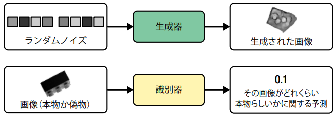
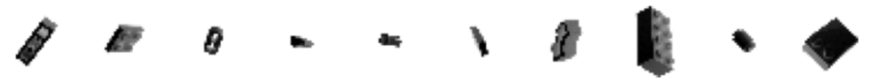
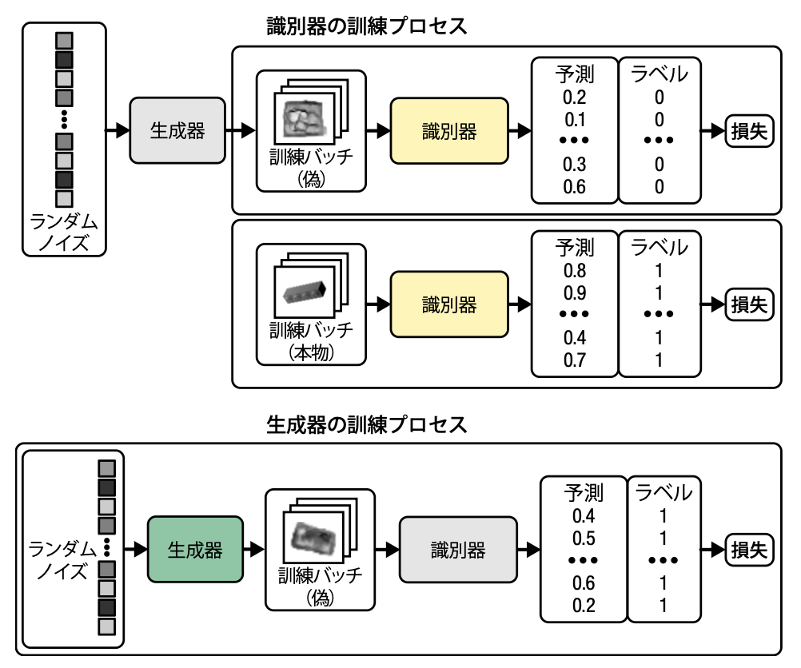
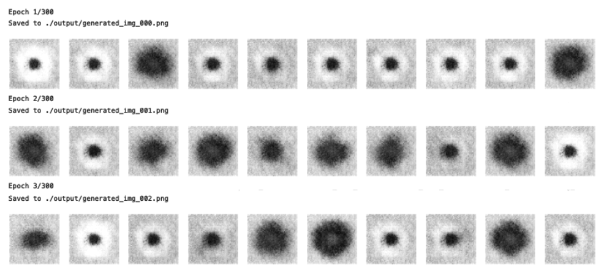
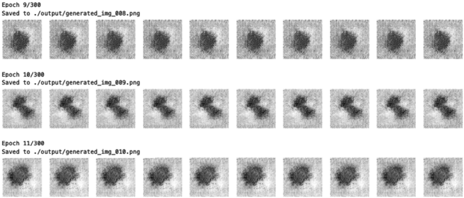
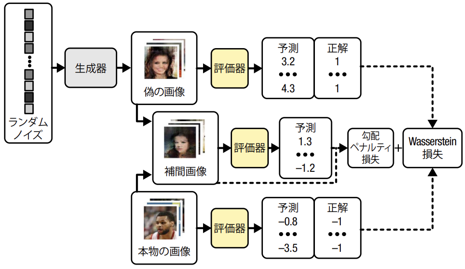

# 第4章 敵対的生成ネットワーク
**敵対的生成ネットワーク (Generative Adversarial Network: GAN)** は、2014年に Ian Goodfellow らによって提案されたモデル[1]である。
このモデルの核となるアイデアは、現在の生成モデリングにも引き継がれている。  
[1] Ian J. Goodfellow et al., "Generative Adversarial Nets," June 10, 2014, https://arxiv.org/abs/1406.2661

## 4.1 イントロダクション
GAN は **生成器 (generator)** と **識別器 (discriminator)** から構成される。

- 生成器：ランダムの椅子をもとのデータセットからサンプリングした観測に変換しようとする
- 識別機：観測がもとのデータセットから得られたものか、生成器が生成したものかを予測する

    

学習では、生成器はランダムノイズから画像を生成し、識別機はランダムな予測を行う。
生成器がよりうまく識別機を騙し、識別機が正しく判定する能力をより高めるには、この2種類のネットワークの学習を、どう行えばよいかが重要となる。

## 4.2 深層畳み込み GAN (DCGAN)
まずは、2015年に発表された Alec Radford らの論文[2] (DCGAN: Deep Convolutional GAN) の流れを厳密にたどる。  
[2] Alec Radford et al., "Unsupervised Representation Learning with Deep Convolutional Generative Adversarial Networks," January 7, 2016, https://arxiv.org/abs/1511.06434

### 4.2.1 Bricks データセット
学習用のデータセットとして、4万枚の LEGO 画像データセット [Bricks](https://www.kaggle.com/datasets/joosthazelzet/lego-brick-images) を利用する。

    

オリジナルの画像サイズは 400x400 や 200x200 ピクセルだが、64x64 ピクセルにリサイズして利用する。
また、ピクセル値の値域は [0, 255] であるが、[-1, 1] の範囲にスケーリングし、最終層の活性化関数に tanh 関数を使えるようにする。

### 4.2.2 識別器
識別器の目的は、画像が本物か偽物かを判定する教師あり画像分類問題である。
そのため、次のようなアーキテクチャのネットワークを実装する。

| 層の種類 | 出力形状 | パラメータ数 |
| :-- | :-- | :-- |
| InputLayer | (None, 64, 64, 1) | 0 |
| 4x4 Conv2D | (None, 32, 32, 64) | 1,024 |
| LeakyReLU | (None, 32, 32, 64) | 0 |
| Dropout | (None, 32, 32, 64) | 0 |
| 4x4 Conv2D | (None, 16, 16, 128) | 131,072 |
| BatchNormalization | (None, 16, 16, 128) | 512 |
| LeakyReLU | (None, 16, 16, 128) | 0 |
| Dropout | (None, 16, 16, 128) | 0 |
| 4x4 Conv2D | (None, 8, 8, 256) | 524,288 |
| BatchNormalization | (None, 8, 8, 256) | 1,024 |
| LeakyReLU | (None, 8, 8, 256) | 0 |
| Dropout | (None, 8, 8, 256) | 0 |
| 4x4 Conv2D | (None, 4, 4, 512) | 2,097,152 |
| BatchNormalization | (None, 4, 4, 512) | 2048 |
| LeakyReLU | (None, 4, 4, 512) | 0 |
| Dropout | (None, 4, 4, 512) | 0 |
| 4x4 Conv2D | (None, 1, 1, 1) | 8,192 |
| Flatten | (None, 1) | 0 |

最終層の畳み込み層では、活性化関数に Sigmoid 関数を用いて [0, 1] の値を出力する。

### 4.2.3 生成器
生成器には、多変量正規分布から生成したベクトルを入力として、変分オートエンコーダのデコーダと似たアーキテクチャのネットワークを用いる。
このようなアーキテクチャを用いることで、潜在空間のベクトルを操作するだけで、元の領域内の画像が持つ高いレベルの特徴を変更できる。

| 層の種類 | 出力形状 | パラメータ数 |
| :-- | :-- | :-- |
| InputLayer | (None, 100) | 0 |
| Reshape | (None, 1, 1, 100) | 0 |
| 4x4 Conv2DTranspose | (None, 4, 4, 512) | 819,200 |
| BatchNormalization | (None, 4, 4, 512) | 2048 |
| LeakyReLU | (None, 4, 4, 512) | 0 |
| 4x4 Conv2DTranspose | (None, 8, 8, 256) | 2,097,152 |
| BatchNormalization | (None, 8, 8, 256) | 1024 |
| LeakyReLU | (None, 8, 8, 256) | 0 |
| 4x4 Conv2DTranspose | (None, 16, 16, 128) | 524,288 |
| BatchNormalization | (None, 16, 16, 128) | 512 |
| LeakyReLU | (None, 16, 16, 128) | 0 |
| 4x4 Conv2DTranspose | (None, 32, 32, 64) | 131,072 |
| BatchNormalization | (None, 32, 32, 64) | 256 |
| LeakyReLU | (None, 32, 32, 64) | 0 |
| 4x4 Conv2DTranpose | (None, 64, 64, 1) | 1,024 |

転置畳み込み層の代わりに、アップサンプリング層 (UpSampling2D) とストライドが1の畳み込み層を用いても良い。
転置畳み込み層を使った場合、出力画像に細かな市松模様のようなピクセルが発生しやすいが、多くの GAN では転置畳み込み層が用いられる。

### 4.2.4 DCGAN を訓練する
GAN において学習プロセスは非常に重要である。

- 識別器の学習
  - 学習セットから取り出した本物の画像と、生成器で出力した偽物の画像を用意する
  - 本物の画像のラベルが 1、偽物の画像のラベルが 0 の教師あり学習として扱う
  - 損失関数には２値交差エントロピーを用いる
- 生成器の学習
  - ランダムノイズから生成した画像を識別器に入力し、その出力を取得する
  - 識別器の出力が 1 に近づくように生成器を学習する
  - 損失関数には２値交差エントロピーを用いる

    

生成器と識別器は常に優劣を争うため、学習が不安定になる場合もある。
理想的には、生成器が識別器がら意味のある情報を学習できるような均衡を見つけると、生成される画像の品質が向上する。

### 4.2.5 DCGAN の分析
生成器の出力する画像を可視化してみると、学習が進むに従って訓練セットに近い画像を生成できるようになっている。
すなわち、ランダムノイズを陰や直方体、円などをどう描くかという高次の概念を学習できている。
実際、生成された画像と学習セットの画像の L1 距離が最も近い画像を抽出してみると、ある程度似ているが異なる画像を生成できていることが分かる。

### 4.2.6 GAN の訓練：ヒントとコツ
GAN は学習が難しいことが知られている。
ここでは学習時に直面しやすい問題と、その解決方法について述べる。

#### 4.2.6.1 識別器が生成器を圧倒する
識別器が強くなり本物と偽物を完全に見分けられるようになると、生成器の学習に必要な勾配が消失し、以下に示すように画像をうまく生成できなくなる。

    

もし、識別器が強くなりすぎた場合には、次のような調整を行う。

- 識別器の Dropout 層の rate パラメータを大きくする
- 識別器の学習率を下げる
- 識別器の畳み込みフィルタの数を減らす
- 識別器の訓練時にラベルにノイズを加える
- 識別器の訓練時に画像のラベルをランダムに反転させる

#### 4.2.6.2 生成器が識別器を圧倒する
識別器が十分に強力でない場合、生成器は識別器を簡単に騙せる方法を発見してしまい、**モード崩壊**を起こす。
**モード**とは常に識別器を欺く単一の観測のことで、識別器を学習せずに生成器を数バッチ学習させると、次の画像のようなモードが出力されるようになる。

    

一度モード崩壊を起こすと、潜在空間内のすべての点から同じ画像が生成されるようになり、損失の勾配も0に近づくため、この状態から抜け出すことはできない。
モード崩壊が発生した場合には、4.2.6.1 で述べた方法とは逆の方策で識別器を強化する。
あるいは、両方のネットワークの学習率を下げたり、バッチサイズを大きくしたりするのも有効である。

#### 4.2.6.3 役に立たない損失
DCGAN は、生成器をある時点の識別器が評価し、その識別器が学習によって精度を高めていくため、学習過程の各時点における損失関数の値を単純に比較できない。
つまり、生成器の損失と出力画像の品質の間に相関関係が乏しく、GAN の学習はモニタリングしづらい。

#### 4.2.6.4 ハイパーパラメータ
DCGAN には、バッチ正規化、ドロップアウト、学習りつ、活性化関数、畳み込みフィルタ、カーセルサイズ、ストライド、バッチサイズ、潜在空間のサイズなどハイパーパラメータがあり、これら全てのパラメータに敏感に反応しやすいという特徴を持つ。
これらの調整について確立されたガイドラインはなく、経験則に基づくトライ＆エラーとなる。

#### 4.2.6.5 GAN の課題に取り組む
これまで述べたように、DCGAN の学習は非常に不安定である。
この問題に対処する手法がいくつか提案され、その安定性は大きく改善している。

## 4.3 勾配ペナルティ付き Wasserstein GAN (WGAN-GP)
Arjovsky らが2017年に発表した Wasserstein GAN (WGAN) [3] では、以下の2つの特徴を持つ学習方法で GAN の学習を行っている。  
[3] Martin Arjovsky et al., "Wasserstein GAN," January 26, 2017, https://arxiv.org/abs/1701.07875

- 生成器の学習の収束と生成画像の品質に相関する意味のある損失
- 最適化プロセスの安定性の改善

この論文では、2値交差エントロピー損失の代わりに識別器と生成器の両方に Wassestein 損失関数を導入することで、GAN の収束が安定する。

### 4.3.1 Wassestein 損失
まず、2値交差エントロピー損失は以下の式で定義される。

$$
-\frac{1}{n} \sum_{i=1}^{n} \big(y_i \log (p_i) + (1 - y_i) \log (1 - p_i) \big)
$$

GAN の識別器 $D$ を学習するには、本物の画像の予測 $p_i = D(x_i)$ とラベル $y_i = 1$ を比較する場合と、生成器 $G$ がランダムノイズ $z_i$ の生成する偽物の画像の予測 $p_i = D \big(G(x_i) \big)$ とラベル $y_i = 0$ を比較する場合の2値交差エントロピーを計算して和を取って損失関数とし最小化する。

$$
\min_D -\Big( \mathbb{E}_{x～px} \big[\log D(x)] + \mathbb{E}_{z～pz} \big[\log (1 - D(G(z)))] \Big)
$$

GAN の生成器 $G$ を学習するには、生成した画像の予測 $p_i = D \big(G(z_i) \big)$ とラベル $y_i = 1$ との2値交差エントロピー損失を損失関数として最小化する。

$$
\min_G -\Big( \mathbb{E}_{z～pz} \big[\log (D(G(x)))] \Big)
$$

一方、Wasserstein 損失には次のような特徴がある。

- ラベルには 1 と -1 を用いる
- 識別層の最終層から Sigmoid 関数を削除し、値域を $[-\infty, \infty]$ とする
- 識別器は **スコア*** を出力する **評価器** (critic) と呼ぶ

Wasserstein 損失は以下の式で定義される。

$$
-\frac{1}{n} \sum_{i=1}^{n} y_i p_i
$$

WGAN の識別器 $D$ を学習するには、本物の画像の予測 $p_i = D(x_i)$ とラベル $y_i = 1$ を比較する場合と、生成器 $G$ がランダムノイズ $z_i$ の生成する偽物の画像の予測 $p_i = D \big(G(x_i) \big)$ とラベル $y_i = -1$ を比較する場合の Wasserstein 損失の差を損失関数とし最小化する。
すなわち、本物の画像の予測値と、生成された画像の予測値の差を最大化する。

$$
\min_D -\Big( \mathbb{E}_{x～px} \big[D(x)] - \mathbb{E}_{z～pz} \big[D(G(z))] \Big)
$$

GAN の生成器 $G$ を学習するには、生成した画像の予測 $p_i = D \big(G(z_i) \big)$ とラベル $y_i = 1$ との Wasserstein 損失を損失関数として最小化する。

$$
\min_G -\Big( \mathbb{E}_{z～pz} \big[D(G(x))] \Big)
$$

### 4.3.2 Lipschitz 制約
一般に、ニューラルネットワークの計算過程で大きな値が出現することは避けるべきであるが、WGAN では Sigmoid 関数を用いないため、$(-\infty, \infty)$ の値を出力できてしまう。
そこで、評価器が **1-Lipschitz 連続関数$** である必要があるという制約を課す。
具体的には、任意の入力 $x_1, x_2$ に対して以下の不等式を満たす時、1-Lipschitz であるという。

$$
\frac{|D(x_1) - D(x_2)|}{|x_1 - x_2|} \leq 1
$$

$|x_1 - x_2|$ は入力画像間のピクセルごとの差の絶対値であり、$|D(x_1) - D(x_2)|$ は評価器の出力する予測間の差の絶対値である。
すなわち、勾配の絶対値が1を超えないように制限を掛けている。

### 4.3.3 Lipschitz 制約を課す
WGAN では、各学習バッチ後の評価器の重みを $[-0.01, 0.01]$ にクリッピングすることで、Lipschitz 制約を課すことができる。
しかし、クリッピングによって評価器の能力が損なわれてしまう。
そこで、勾配損失ペナルティ損失付き Wassestein GAN (Wasserstein GAN with Gradient Penalty: WGAN-GP) が提案されている。
いくつかの派生型が提案されているが、例えば勾配ノルムが 1 から外れた場合にモデルにペナルティを与える勾配ペナルティ項を評価器の損失関数に加える手法 [4] が提案されている。

[5] Ishaan Gulrajani et al., "Improved Training of Wasserstein GANs," March 31, 2017, https://arxiv.org/abs/1704.00028

### 4.3.4 勾配ペナルティ損失
WGAN-GP の評価器の学習プロセスを以下に示す。

    

勾配ペナルティ損失は、入力画像に関する予測の勾配ノルムと1との差の平方根を計算する。
これによって、自然に勾配ペナルティ項が最小化されるように最適化され、Lipschitz 制約を満たすようになる。
ただし、勾配ペナルティ損失は本物画像のバッチと偽物画像のバッチをペアにしてつないだ線に沿って、ランダムに選ばれた点にある補間画像について計算する。

### 4.3.5 WGAN-GP を訓練する
Wasserstein 損失を利用する利点として、評価器と生成器の訓練のバランスを気にする必要がない点が挙げられる。
生成器の更新1回につき、評価器を3～5回程度更新すれば良い。
(以降は Jupyter Lab で実装)

### 4.3.6 WGAN-GP の分析
(実装後に振り返り)

## 4.4 条件付き GAN (CGAN)
これまでの GAN は、潜在空間からランダムに点をサンプリングして画像を生成することはできるが、そのサンプリングによって生成する画像を制御することは難しい。
そこで、出力を制御可能な**条件付き GAN (Conditional GAN: CGAN)** が提案されている。
ここでは、2014年に Mirza と Osindero によって提案された "Conditional Generative Adversarial Nets" [5] を紹介する。

[5] Mehdi Mirza and Simon Osindero, "Conditional Generative Adversarial Nets," November 6, 2014, https://arxiv.org/abs/1411.1784

### 4.4.1 CGAN アーキテクチャ
ここでは、CelebA データセットの Blond_Hair (金髪) 属性に CGAN を条件付けし、明示的に金髪の画像を指定して生成できるようにする。
CGAN では、画像の属性情報を one-hot エンコーディングベクトルとして潜在空間サンプルに追加する。
評価器では、one-hot エンコーディングベクトルを繰り返して入力画像と同じ形状にすることで、属性情報を RGB 画像のチャネルとして追加する。

    

生成器が画像の属性と一致しない画像を生成してしまうと、識別器が簡単に偽物だと判定できてしまうため、生成器では出力が期待する属性と一致することを保証する必要がある。

(以降は実装)

### 4.4.2 CGAN を訓練する
(Jupyter Lab で実装)

### 4.4.3 CGAN の分析
(実装後に振り返り)

## 4.5 まとめ
ここでは、深層畳み込み GAN (DCGAN)、勾配ペナルティ付き Wassestein GAN (WGAN-GP)、条件付き GAN (CGAN) という、3種類の敵対的生成ネットワーク (GAN) を紹介した。
いずれも、本物と偽物を判別しようとする識別器/評価器と、それを騙そうとする生成器で構成されたモデルである。  
DCGAN でも十分本物に近い画像を生成できる一方、モード崩壊や勾配消失により学習が失敗する可能性がある。
そこで、WGAN-GP では Wasserstein 損失関数を導入し、学習過程に 1-Lipschitz 制約を課して、安定的な学習を実現した。
また、VAE と似たようなプロセスで画像を生成できるものの、WGAN-GP のほうがより良い結果が得られることを確認した。
さらに、CGAN では評価器と生成器に属性情報を渡すことで、生成できる画像の種類を制御できるようになった。
