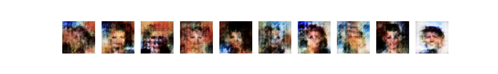
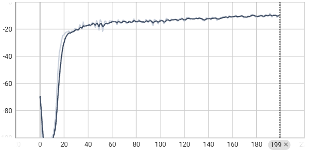
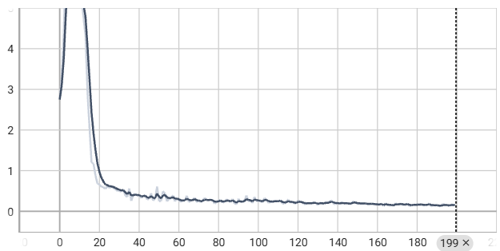
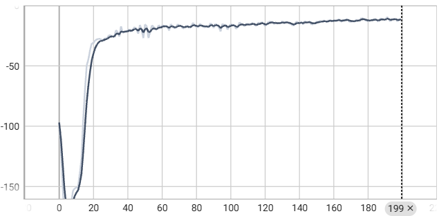
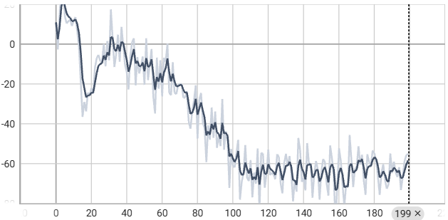
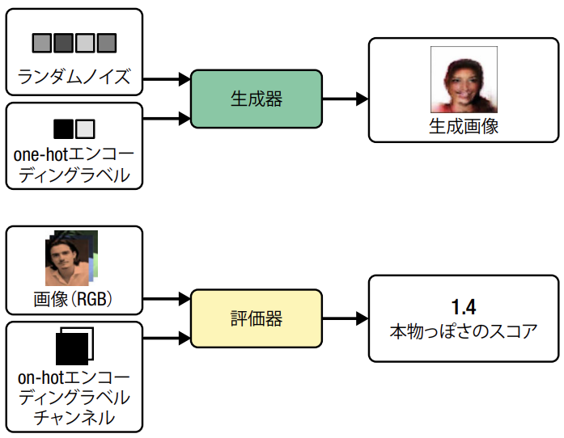
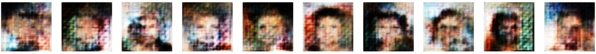
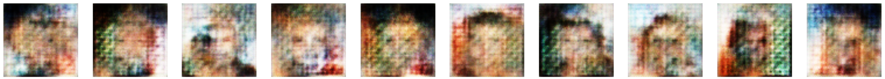
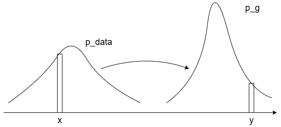

# 第4章 敵対的生成ネットワーク (後半)
今回は、DCGAN の改良版として、 WGAN-GP (Wasserstein GAN with Gradient Penalty: 勾配ペナルティ付き Wasserstein GAN) と CGAN (Conditional GAN) を紹介する。
また、WGAN-GP について、Wasserstein 損失関数の導入理由などについて補足する。

## 4.3 勾配ペナルティ付き Wasserstein GAN (WGAN-GP)
Arjovsky らが2017年に発表した Wasserstein GAN (WGAN) [3] では、以下の2つの特徴を持つ学習方法で GAN の学習を行っている。  
[3] Martin Arjovsky et al., "Wasserstein GAN," January 26, 2017, https://arxiv.org/abs/1701.07875

- 生成器の学習の収束と生成画像の品質に相関する意味のある損失
- 最適化プロセスの安定性の改善

この論文では、2値交差エントロピー損失の代わりに識別器と生成器の両方に Wassestein 損失関数を導入することで、GAN の収束が安定する。

### 4.3.1 Wassestein 損失
まず、2値交差エントロピー損失は以下の式で定義される。

$$
-\frac{1}{n} \sum_{i=1}^{n} \big(y_i \log (p_i) + (1 - y_i) \log (1 - p_i) \big)
$$

DCGAN の識別器 $D$ を学習するには、本物の画像の予測 $p_i = D(x_i)$ と、そのラベル $y_i = 1$ を比較する場合、および生成器 $G$ がランダムノイズ $z_i$ から生成する偽物の画像の予測 $p_i = D \big(G(x_i) \big)$ と、そのラベル $y_i = 0$ を比較する場合の2値交差エントロピーを計算し、以下の最適化を行う。

$$
\min_D -\Big( \mathbb{E}_{x \sim px} \big[\log D(x)] + \mathbb{E}_{z \sim pz} \big[\log (1 - D(G(z)))] \Big)
$$

DCGAN の生成器 $G$ を学習するには、生成した画像の予測 $p_i = D \big(G(z_i) \big)$ と、正解ラベル $y_i = 1$ との2値交差エントロピー損失を最適化する。

$$
\min_G -\Big( \mathbb{E}_{z \sim pz} \big[\log (D(G(z)))] \Big)
$$

一方、Wasserstein 損失には次のような特徴がある。

- ラベルには 1 と -1 を用いる
- 識別層の最終層から Sigmoid 関数を削除し、値域を $[-\infty, \infty]$ とする
- 識別器は **スコア*** を出力する **評価器** (critic) と呼ぶ

Wasserstein 損失は以下の式で定義される。

$$
-\frac{1}{n} \sum_{i=1}^{n} y_i p_i
$$

WGAN の識別器 $D$ を学習するには、本物の画像の予測 $p_i = D(x_i)$ とラベル $y_i = 1$ を比較する場合と、生成器 $G$ がランダムノイズ $z_i$ の生成する偽物の画像の予測 $p_i = D \big(G(x_i) \big)$ とラベル $y_i = -1$ を比較する場合の Wasserstein 損失の差を損失関数とし最小化する。
すなわち、本物の画像の予測値と、生成された画像の予測値の差を最大化する。

$$
\min_D -\Big( \mathbb{E}_{x \sim px} \big[D(x)] - \mathbb{E}_{z \sim pz} \big[D(G(z))] \Big)
$$

GAN の生成器 $G$ を学習するには、生成した画像の予測 $p_i = D \big(G(z_i) \big)$ とラベル $y_i = 1$ との Wasserstein 損失を損失関数として最小化する。

$$
\min_G -\Big( \mathbb{E}_{z \sim pz} \big[D(G(z))] \Big)
$$

### 4.3.2 Lipschitz 制約
一般に、ニューラルネットワークの計算過程で大きな値が出現することは避けるべきであるが、WGAN では Sigmoid 関数を用いないため、$(-\infty, \infty)$ の値を出力できてしまう。
そこで、評価器が **1-Lipschitz 連続関数** である必要があるという制約を課す。
具体的には、任意の入力 $x_1, x_2$ に対して以下の不等式を満たす時、1-Lipschitz であるという。

$$
\frac{|D(x_1) - D(x_2)|}{|x_1 - x_2|} \leq 1
$$

$|x_1 - x_2|$ は入力画像間のピクセルごとの差の絶対値であり、$|D(x_1) - D(x_2)|$ は評価器の出力する予測間の差の絶対値である。
すなわち、勾配の絶対値が1を超えないように制限を掛けている。

### 4.3.3 Lipschitz 制約を課す
WGAN では、各学習バッチ後の評価器の重みを、ある定数 $c$ を用いて $[-c, c]$ (論文中では  $[-0.01, 0.01]$) にクリッピングすることで、Lipschitz 制約を課すことができる。
しかし、クリッピングによって評価器の能力が損なわれてしまう。
そこで、**勾配ペナルティ損失付き Wassestein GAN (Wasserstein GAN with Gradient Penalty: WGAN-GP)** が提案されている。
いくつかの派生型が提案されているが、例えば勾配ノルムが 1 から外れた場合にモデルにペナルティを与える勾配ペナルティ項を評価器の損失関数に加える手法 [4] が提案されている。

[5] Ishaan Gulrajani et al., "Improved Training of Wasserstein GANs," March 31, 2017, https://arxiv.org/abs/1704.00028

### 4.3.4 勾配ペナルティ損失
WGAN-GP の評価器の学習プロセスを以下に示す。

勾配ペナルティ損失は、入力画像に関する予測の勾配ノルムと1との差の平方根を計算する。
これによって、自然に勾配ペナルティ項が最小化されるように最適化され、Lipschitz 制約を満たすようになる。
ただし、勾配ペナルティ損失は本物画像のバッチと偽物画像のバッチをペアにしてつないだ線に沿って、ランダムに選ばれた点にある補間画像について計算する。

### 4.3.5 WGAN-GP を訓練する
Wasserstein 損失を利用する利点として、評価器と生成器の訓練のバランスを気にする必要がない点が挙げられる。
生成器の更新1回につき、評価器を3～5回程度更新すれば良い。
(以降 Jupyter Lab で実装)

### 4.3.6 WGAN-GP の分析
200 エポック学習時点で生成器では以下のような画像が生成できるようになっている。

また、TensorBoard で可視化した学習曲線は以下の通り。

さらに、600 エポックまで回すとより鮮明な画像が得られる。
一般に、GAN のほうが VAE よりも鮮明な画像を生成できることが知られている。
ただし、GAN は VAE よりも学習が難しく、生成される画像の品質が安定するまでに長い時間がかかる。

## 4.4 条件付き GAN (CGAN)
これまでの GAN は、潜在空間からランダムに点をサンプリングして画像を生成することはできるが、そのサンプリングによって生成する画像を制御することは難しい。
そこで、出力を制御可能な**条件付き GAN (Conditional GAN: CGAN)** が提案されている。
ここでは、2014年に Mirza と Osindero によって提案された "Conditional Generative Adversarial Nets" [5] を紹介する。

[5] Mehdi Mirza and Simon Osindero, "Conditional Generative Adversarial Nets," November 6, 2014, https://arxiv.org/abs/1411.1784

### 4.4.1 CGAN アーキテクチャ
ここでは、CelebA データセットの Blond_Hair (金髪) 属性に CGAN を条件付けし、明示的に金髪の画像を指定して生成できるようにする。
CGAN では、画像の属性情報を one-hot エンコーディングベクトルとして潜在空間サンプルに追加する。
評価器では、one-hot エンコーディングベクトルを繰り返して入力画像と同じ形状にすることで、属性情報を RGB 画像のチャネルとして追加する。

生成器が画像の属性と一致しない画像を生成してしまうと、識別器が簡単に偽物だと判定できてしまうため、生成器では出力が期待する属性と一致することを保証する必要がある。

(以降は実装)

### 4.4.2 CGAN を訓練する
(Jupyter Lab で実装)

### 4.4.3 CGAN の分析
生成器に対して one-hot エンコーディングされたラベル情報を渡して、CGAN の出力を制御することができる。
潜在ベクトルは共通で、ラベル情報のみを入れ替えて画像を生成すると、下の図のような結果が得られる。
(2,000 エポック回しましたがイマイチです。心の目で感じてください。。。)

このように、GAN はここの特徴量を互いに切り離すように潜在空間内の点を整理できる。

## 4.5 まとめ
今回は、勾配ペナルティ付き Wassestein GAN (WGAN-GP)、条件付き GAN (CGAN) という、2種類の敵対的生成ネットワーク (GAN) を紹介した。

- WGAN-GP：Wasserstein 損失関数を導入し、学習過程に 1-Lipschitz 制約を課して安定的な学習を実現する
- CGAN：入力データにラベル情報を付与して学習することで生成器の出力を制御できる

また、VAE と似たようなプロセスで画像を生成できるものの、WGAN-GP のほうがより良い結果が得られる。
さらに、CGAN では評価器と生成器に属性情報を渡すことで、生成できる画像の種類を制御できるようになった。
10章では、さらに拡張を施した GAN を紹介する。

(個人的な感想)  
実際にコードを動かしてみたものの、生成された画像が鮮明かと言われるとそうでもない。
WGAN-GP は 200 エポック (書籍掲載の結果では600エポック)、CGAN は 2,000 エポック学習させたが、足りなかったのかもしれない。
WGAN-GP の損失関数の導入は、書籍内では天下り的に書かれていたが、調べてみるとしっかりと論理的に裏付けされた手法であった。

### (補足) Wasserstein 損失関数について
#### 従来の GAN の損失関数の問題点
前回の付録より、GAN の学習は識別器 $D$ と生成器 $G$について、以下の利得関数 $V(D, G)$ の minmax 定理を用いた最適化として定式化される。
(付録の式では識別器のパラメータ $\theta^D$ と生成器のパラメータ $\theta^G$ の式 $V(\theta^D, \theta^G)$ になっているが、簡単のため $\theta$ は省略)

$$
V(D, G) = \frac{1}{2} \mathbb{E}_{x \sim p_r(x)}\big[\log D (x) \big] + \frac{1}{2} \mathbb{E}_{z \sim p_z(z)}\big[\log (1 - D(G(z)) \big]
$$

ただし、$p_r$ は実データの分布、$p_z$ は潜在区間内のデータ分布 (通常は一様分布) である。
潜在空間からサンプリングした点 $z$ を生成器 $G$ に通してデータを生成することは、生成データの分布 $p_g$ からデータ $x$ をサンプリングすることと等価である。
よって、左辺の $\mathbb{E}_{z \sim p_z(z)}\big[\log (1 - D(G(z)) \big]$ は $\mathbb{E}_{x \sim p_g(x)}\big[\log (1 - D(x) \big]$ に置き換えられる。
また、$\frac{1}{2}$ も本質的ではないので省略すると、利得関数は以下のように書き直すことが可能。

$$
\begin{aligned}
V(D, G) &= \mathbb{E}_{x \sim p_r(x)}\big[\log D (x) \big] + \mathbb{E}_{z \sim p_g(x)}\big[\log (1 - D(x) \big] \\
&= \sum_x \Big( p_r(x) \log \big( D(x) \big) + p_g(x) \log \big( 1 - D(x) \big) \Big)
\end{aligned}
$$

$\sum$ の中身を $D(x)$ について微分すると、以下の式が得られる。

$$
\frac{d}{d D(x)} \Big( p_r(x) \log \big( D(x) \big) + p_g(x) \log \big( 1 - D(x) \big) \Big) = \frac{1}{\ln 10} \frac{p_r (x) - \big( p_r(x) + p_g (x) \big) D(x)}{D(x) \big( 1- D(x) \big)}
$$

よって、最適な識別器 $D^*$ が得られた場合、すなわち上式の値が0となる場合、$D^*$ は次のように表される。

$$
D^*(x) = \frac{p_r(x)}{p_r(x) + p_g(x)}
$$

これを $V(D, G)$ に代入すると、以下のように式変形できる。

$$
\begin{aligned}
V(D^*, G) &= \sum_x \Bigg(p_r(x) \log \frac{p_r(x)}{p_r(x) + p_g(x)} + p_{g}(x) \log \frac{p_g(x)}{p_r(x) + p_g(x)} \Bigg) \\
&= \Big( D_{KL} \big(p_r || \frac{p_r + p_g}{2} \big) - \log 2 \Big) + \Big( D_{KL} \big(p_g || \frac{p_r + p_g}{2} \big) - \log 2 \Big) \\
&= 2 D_{JS} (p_r || p_g) - 2 \log 2
\end{aligned}
$$

ただし、$D_{KL}$ は KL ダイバージェンス (Kullback-Leibler divergence)、$D_{JS}$ は JS ダイバージェンス (Jensen-Shannon divergence) である。
ある確率分布 $P, Q$ に対して $D_{KL}$ は非対称 ($D_{KL} (P||Q) \neq D_{KL} (Q||P)$) なため、距離としての性質を満たさない。
そこで、対称性を持ち距離としての性質を備えた指標として、JS ダイバージェンスは以下の式で定義される。

$$
\begin{aligned}
D_{JS}(P||Q) &= \frac{1}{2} \Big(D_{KL}(P || R) + D_{KL}(Q || R) \Big) \\
R(X = x) &= \frac{1}{2} \big( P(X = x) + Q(X = x) \big)
\end{aligned}
$$

以上のことから、GAN の目的関数自体は直接的に JS ダイバージェンスとは関係ないものの、GAN の最適化は生成器の出力するデータの分布と実データの分布の距離 (JS ダイバージェンス) を最小化する方向に進むことが示唆される。
JS ダイバージェンスは2つの確率分布間に重なりがない場合、値が $\log 2$ で一定となるため勾配が消失する。
学習の初期段階では生成器の能力が低く、$p_r$ と $p_g$ が重なっていないことが多いため、勾配が消失し学習が進まなくなる。
このように、GAN の学習の不安定性は損失関数の性質に起因している。

#### 分布間の距離指標の置き換え
上述のように、暗黙的にではあるが DCGAN の識別器 $D$ は生成器 $G$ の出力するデータの分布 $p_g$ と実データの分布 $p_r$ の JS ダイバージェンスが最大となるように学習していた。
しかし、JS ダイバージェンスの性質のために勾配消失などの問題が生じ、学習が不安定になる。
そこで、2つのデータ分布 $p_g$ と $p_r$ の距離を最大化するというコンセプトはそのままに、JS ダイバージェンス以外に分布間の距離を測る指標がないか検討する。  
天下り的ではあるが、ここで登場するのが Wsserstein 距離 (別名 Earth Mover's Distance: アースムーバー距離) である。
Wassestein 距離は、JS ダイバージェンスとは異なり分布間の重なりがない場合でも値が0にならず、勾配消失が発生しないという利点がある。

#### Wassestein 距離とは
Wassestein 距離は、1781年にガスパール・モンジュ (Gaspard Monge)の提起した「モンジュの最適輸送問題」に端を発する。
この問題は、ある場所に積まれた土 (earth) を別の場所に輸送する (move) のにかかるコストを最小化する問題を定式化し、そのコストを最小化することを考える。
ある分布 $P$ の「土」を別の分布 $Q$ の「穴」に移動する場合に、「移動する土の量」と「移動距離」を考慮したコストのうち、その最小コストを Wasserstein 距離と定義する。
そのため、Wassestein 距離は Earth Mover's Distance とも呼ばれる。  

ここからは、実データの分布 $p_r$ と生成データの分布 $p_g$ の Wasserstein 距離 $W(p_r, p_g)$ ついて考える。
$\gamma (x, y)$ を $p_r$ のある地点 $x$ から $p_g$ のある地点 $y$ に移動する「土の量」とする。
ここに $x$ と $y$ の移動距離 $|| x - y ||$ を掛けた $\gamma (x, y) || x - y ||$ を「土の輸送コスト」とする。
$p_r$ の「土」を $p_g$ に全て移す時のコストは、以下の式で表される。

$$
\sum_{x,y} \gamma (x, y) || x - y ||
$$

$p_r$ と $p_g$ は確率分布なので、上式は $|| x - y ||$ の期待値 $\mathbb{E}_{x, y \sim \gamma} \big[|| x - y || \big]$ として表せる。
これを最小化したコストが Wasserstein 距離なので、以下のように定式化できる。
ただし、$\Pi (p_r, p_g)$ は $x, y$ の周辺分布が $p_r, p_g$ となるような同時確率分布の集合である。

$$
W(p_r, p_g) = \inf_{\gamma \sim \Pi (p_r, p_g)} \mathbb{E}_{x, y \sim \gamma} \big[|| x - y || \big]
$$

上式では、移動距離の指標としてユークリッド距離を用いているが、ユークリッド距離の2乗を用いてもよい。
厳密には、前者を 1-Wasserstein 距離、後者を 2-Wasserstein 距離と呼んで区別する。
一般の $K$-Wasserstein 距離 $W_K$ は次式で定義される。

$$
W_K(p_r, p_g) = \Bigg(\inf_{\gamma \sim \Pi (p_r, p_g)} \mathbb{E}_{x, y \sim \gamma} \big[|| x - y ||^K \big] \Bigg)^\frac{1}{K}
$$

#### WGAN-GP における Wasserstein 損失関数の導出
Wsserstein 距離の定式化はできたが、同時確率分布の集合 $\Pi (p_r, p_g)$ について全て探索するのは困難である。
そこで、Kantorovich-Rubinstein 双対定理を用いて双対形式に式変形できる。
(双対定理や式変形の詳細は、[この Qiita の記事](https://qiita.com/mittyantest/items/0fdc9ce7624dbd2ee134)を参照のこと)

$$
W(p_r, p_g) = \frac{1}{K} \sup_{||f||_L \leq K} \mathbb{E}_{x \sim p_r} [f(x)] - \mathbb{E}_{y \sim p_g} [f(y)]
$$

ここで、関数 $f$ は $||f||_L \leq K$ を満たす、すなわち $K$-Lipschitz 連続な実数値関数である。
ある実数値関数 $f: \mathbb{R} \rightarrow \mathbb{R}$ が $K$-Lipschitz 連続であるとは、任意の2点 $x_1, x_2$ について、$| f(x_1) - f(x_2) | \leq K | x_1 - x_2 |$ を満たすことである。
つまり、Wasserstein 距離を求める問題は、あらゆる $K$-Lipschitz 連続な実数値関数の中から、$\mathbb{E}_{x \sim p_r} [f(x)] - \mathbb{E}_{y \sim p_g} [f(y)]$ を最大にする関数を見つけ出す問題に置き換えられる。
この $K$-Lipschitz 連続の $K$ と $K$-Wasserstein 距離の $K$ は対応している。
そのため、WGAN-GPでは 1-Wasserstein 距離を用いるので、1-Lipschitz 連続という制約の下で、Wassestein 距離を求める問題を解くことになる。  
最後に、WGAN-GP の構成に合わせて式を置き換える。

- Wasserstein 距離で実データ分布と生成データ分布を分離したいのは評価器 (識別器) $D$ なので、関数 $f$ は $D$ で置き換える
- 実データ分布を $p_r$、生成データ分布を $p_g$ とし、$x, y$ はそれぞれからサンプリングされたデータとする
- さらに、生成データ $y$ は潜在空間上の確率分布 $p_z$ からサンプリングされた点 $z$ から生成器 $G$ によって得られた値である

以上をまとめると、以下の式が得られる。

$$
W(p_r, p_g) = \max_D \Big(\mathbb{E}_{x \sim p_r} \big[D(x)\big] - \mathbb{E}_{z \sim p_z} \big[D(G(z))\big] \Big)
$$

最後に書籍の内容に合わせて実データの分布を $p_r$ から $p_x$ に置き換え、最適化のために $\max$ を $\min$ に置き換えると、書籍と同じ式が得られる

$$
\min_D -\Big( \mathbb{E}_{x \sim px} \big[D(x)] - \mathbb{E}_{z \sim pz} \big[D(G(z))] \Big)
$$