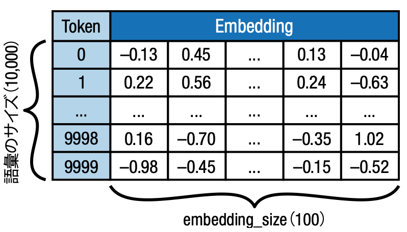
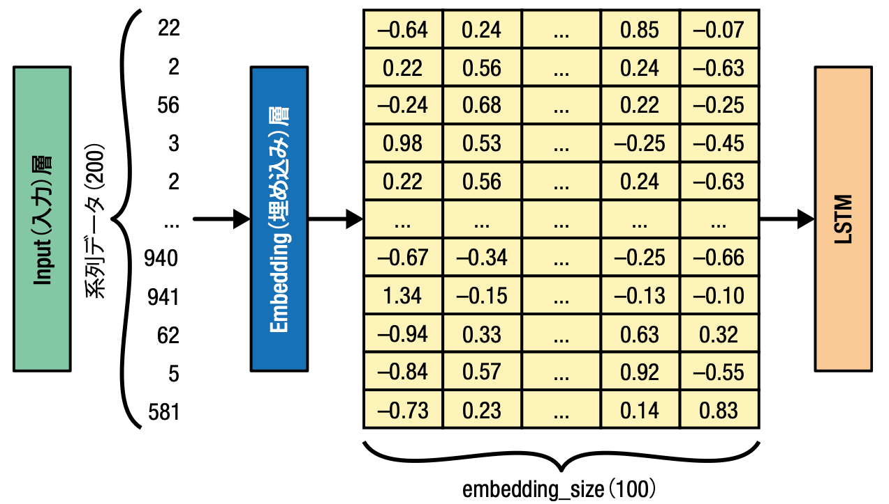
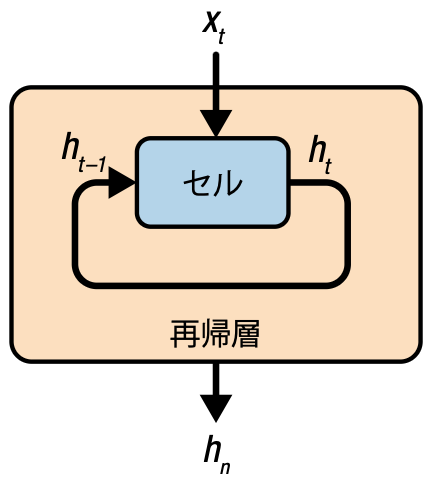
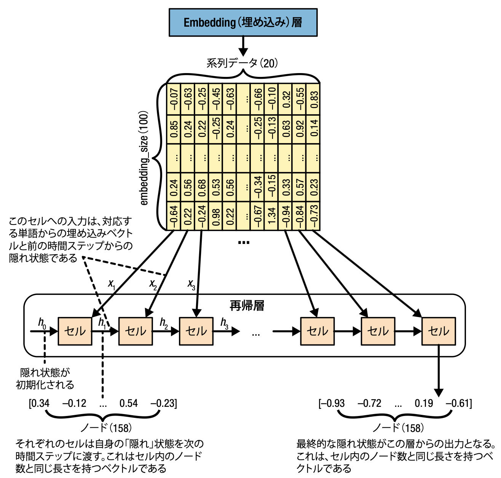
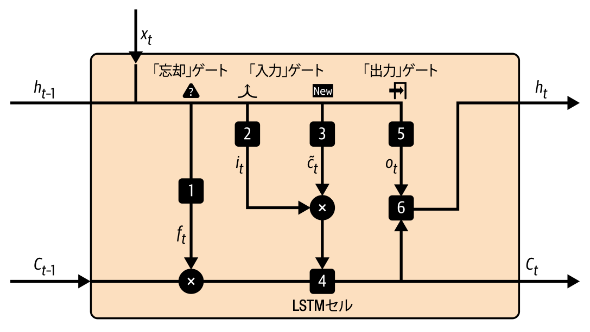

# 第5章 自己回帰モデル
これまで見てきた、変分オートエンコーダ (VAE) と敵対的生成ネットワーク (GAN) は、いずれも潜在空間からサンプリングした点を入力の領域にデコードする方法を学習していた。
ここでは、生成モデリングの問題をシーケンスプロセスとして扱うことによって単純化する **自己回帰モデル (Autoregressive Model)** について学ぶ。
自己回帰モデルは、入力シーケンスの以前の値に関する予測を条件付けする。
そのため、データ生成分布を近似するのではなく、データ生成分布を明示的にモデル化する。  
本章では LSTM (テキスト生成) と PixelCNN (画像生成) について扱う。
トランスフォーマ (Transformer) も自己回帰モデルの一種だが、こちらは第9章で扱う。

## 5.1 イントロダクション
LSTM (Long Short-Term Memory：長・短期記憶) のアナロジーとしての「厄介な悪党のための文芸クラブ」の寓話。
(あまり本筋と関係ないので割愛)

## 5.2 LSTM ネットワーク
LSTM は再帰型ニューラルネットワーク (Recurrent Neural Network: RNN) と呼ばれる深層学習モデルの一種である。
RNN は、再帰層 (**セル**) を持ち、ある時間ステップにおける再帰層からの出力を、次の時間ステップの入力の一部とすることで、時系列データを扱うことができる。  
当初、RNN の再帰層は tanh 活性化関数のみで構成されており、入力を $(-1, 1)$ の範囲に写像していた。
しかし、この方法では勾配消失問題が生じ、長い時系列データに対して適用できなかった。  
LSTM が最初に登場したのは1997年の Sepp Hochreiter と Jürgen Schmidhuber の論文 [1] である。
その論文の中では、勾配消失問題を回避し、数百の時間ステップ長の時系列データから学習可能な手法を提示している。
それ以降、LSTMx や GRU (Gated Recurrent Unit: ゲート付き再帰ユニット) など改良が加えられ、現在でも幅広く利用されている。
本章では、LSTM を用いたテキスト生成について扱うが、時系列予測や感情分析、音声分類などの系列データに幅広く応用可能である。

[1] Sepp Hochreiter and Jürgen Schmidhuber, "Long Short-Term Memory," Neural Computation 9 (1997): 1735--1780, https://www.bioinf.jku.at/publications/older/2604.pdf

### 5.2.1 レシピのデータセット
本章では、Kaggle で公開されている [Epicurious Recipes データセット]() を用いる。
このデータセットには、20,000件以上のレシピのデータが含まれ、栄養情報や成分表などのメタデータが付いている。

### 5.2.2 テキストデータを扱う
これまで扱ってきた画像データとテキストデータの間には以下のような違いがある。

- 画像内のピクセルは連続した色のスペクトラム内の点であるが、テキストは単語や文字といった離散的な塊で表現される。そのため、テキストデータには通常の誤差逆伝播法を適用することができないので、これを回避する方法をつける必要がある。
- 画像データは2つの空間次元を持つが時間次元を持たない。一方、テキストデータは時間次元を持ち、単語の順番が非常に重要である。また、質問に対する回答や代名詞の支持する内容のように、単語間にモデルが捉えるべき長期の時系列的な依存性が存在する。
- 画像データでは数ピクセル程度の変更で内容が大きく変化することはないが、テキストデータは単語や文字のわずかな変更に対して敏感に反応する。そのため、筋の通ったテキストを生成できるようにモデルを学習するのが非常に難しい。
- 画像のピクセル値の割り当てには従うべき規則はないが、テキストデータは規則に基づく文法構造を持つ。また、モデル化するのが非常に難しい意味規則も存在し、文法的には正しくても意味を成さない場合もある。

### 5.2.3 トークン化する
テキストを時系列データとして扱うために、まずはテキストを**トークン化**する。
トークン化とはテキストを単語や文字のような個別のユニットに分割する処理である。
トークン化の方法は、テキスト生成モデルの目的に依存するが、単語でトークン化する場合と文字でトークン化する場合で、次のようなメリット・デメリットがある。

#### 単語でトークン化する場合
- すべてのテキストを小文字に変換し、文頭で大文字から始まる単語と文中に現れる単語を同じ方法でトークン化できる。ただし、固有名詞などについては、大文字のまま単独のトークンとして扱っても良い。
- テキストの語彙が膨大になるため、いくつかの単語は非常に稀、あるいは1回しか現れないこともある。そのため、出現頻度の低い単語は未知語用のトークンに置き換え、ニューラルネットワークの学習する必要のある重みを削減した方が良い場合がある。
- 単語は最も簡単な形に縮退する**語幹化**が可能である。例えば、"browse", "browsing", "browses", "browsed" は全て "browse" に縮退できる。
- 句読点はトークン化するか、全て削除する必要がある場合もある。
- 学習データが持つ語彙以外の単語を予測出来なくなる

#### 文字でトークン化する場合
- 学習データの語彙に含まれない新しい単語を形成するような文字列を生成できる可能性がある。
- 大文字は小文字に変換しても良いし、別トークンとして残すこともできる
- 必要な語彙が少なくなるため、出力層で学習する重みの個数が少なくなり、学習を高速化できる。

ここでは、すべての文字を小文字に変換した上で、語幹化は行わず、文の開始や終了を予測するため、句読点も含めてトークン化する。
また、系列データ長は200とし、目的変数を作成できるように、それより１だけ長いリストを作成し、ベクトルの終わりは０ (ストップトークン) でパディングする。
さらに、出現頻度上位10,000語に含まれない単語には 1 (```[UNK]``` トークン) を割り当てる。
この時、語彙に含める単語数も学習のパラメータとなる。

### 5.2.4 訓練セットを作成する
本章では、ある時点において先行する単語のシーケンスが与えられた時に、そのシーケンスの次の単語を予測するように LSTM を学習する。
そのため、系列データ全体を1トークンずつずらすことで目的変数を作成できる。

### 5.2.5 LSTM アーキテクチャ
LSTM モデル全体のアーキテクチャは次の通りである。
モデルへの入力は整数のトークン系列データで、出力は 10,000 語の語彙の各単語がその系列データの次に現れる確率となる。

| 層 | 出力形状 | パラメータ数 |
| :-- | :-- | :-- |
| InputLayer | (None, None) | 0 |
| Embedding | (None, None, 100) | 1,000,000 |
| LSTM | (None, None, 128) | 117,248 |
| Dense | (None, None, 10000) | 1290,000 |

### 5.2.6 埋め込み層
埋め込み層は、本質的には各整数トークンを長さ ```embedding_size``` のベクトルに変換するルックアプテーブルである。
よって、この層で学習される重みの数は、語彙のサイズと埋め込みベクトルの次元をかけたものに等しくなる。

<div align="center">
    
</div>

埋め込み層によって整数トークンが連続するベクトルに埋め込まれる。
各入力トークンを one-hot エンコーディングすることも可能だが、Embedding 層を使うことで埋め込み方法そのものを学習することができる。
そのため、 InputLayer 層は ```[batch_size, seq_length]``` の形状を持つ整数の系列データからなるテンソルで、このテンソルを Embedding 層で ```[batch_size, seq_length, embedding_size]``` という形状のテンソルに変換する。

<div align="center">
    
</div>

### 5.2.7 LSTM 層
LSTM 層の詳細について述べる前に、一般的な再帰層について見ていく。
再帰層は時系列の入力データ $x_1, \cdots, x_n$ を処理できる。
この層は、ある時間ステップごとに要素 $x_t$ が渡されるたびに、**隠れ状態**を更新するセルを持つ。
隠れ状態は、そのセル内の**ノード**の個数と同じ長さを持つベクトルで、あるセルが入力された時系列データに対して現在どのように理解しているかを表すものであるとみなせる。
時間ステップ $t$ におけるセルの隠れ状態 $h_t$ は、$t-1$ の時間ステップにおける隠れ状態 $h_{t-1}$ と現在の時間ステップのデータ $x_t$ から求められる。
この再帰処理を最後の系列データが入力されるまで行い、セルの最後の隠れ状態 $h_n$ を出力する。

<div align="center">
    
</div>

再帰層内のさらに詳しい処理内容をは以下に示す。
下記の図において、セルはすべて同一であり、処理に使われる重みもすべて共通である。

<div align="center">
    
</div>

### 5.2.8 LSTM セル
LSTM セルは、前の隠れ状態 $h_{t-1}$ と現在の単語の埋め込み $x_t$ から、新しい隠れ状態 $h_t$ を出力する。
隠れ状態のベクトル長はパラメータであり、時系列データの長さとは無関係に設定する。
また、LSTM セルは隠れ状態とは別に、同じ長さのセル状態 $C_t$ を保持する。
これは現在の時系列データの状態に関する、そのセルの内部的な意見と捉えることができる。
具体的な LSTM セル内部の処理は以下の通りである。

<div align="center">
    
</div>

1. 忘却ゲートの演算  
   $h_{t-1}$ と $x_t$ を連結して、重み行列を $W_f$、バイアスを $b_f$、活性化関数を Sigmoid 関数とする全結合層の演算を行う。
   その結果得られるベクトル $f_t$ はセルのノード数と同じ長さを持ち、$(0, 1)$ の値を取る。
   この値が、前のセル状態 $C_{t-1}$ の内容をどのくらい残すべきかを決定する。

$$
f_t = \sigma \Big( W_f \cdot [h_{t-1}, x_t] + b_f \Big)
$$

2. 入力ゲートの演算  
   忘却ゲートと同じく $h_{t-1}$ と $x_t$ を連結して、重み行列を $W_i$、バイアスを $b_i$、活性化関数を Sigmoid 関数とする全結合層の演算を行う。
   その出力 $i_t$ はセルのノード数と同じ長さを持ち、$(0, 1)$ の値を取る。
   この値が、新しい情報を前のセル状態 $C_{t-1}$ にどのくらい加えるかを決定する。

$$
i_t = \sigma \Big( W_i \cdot [h_{t-1}, x_t] + b_i \Big)
$$

3. 保持すべき新しい情報 $\tilde{C}_t$ の生成  
   $h_{t-1}$ と $x_t$ を連結して、重み行列を $W_C$、バイアスを $b_C$、活性化関数を Tanh 関数とする全結合層の演算を行う。
   $\tilde{C}_t$ は $(-1, 1)$ の値を取り、セルのノード数と同じ長さを持つ。

$$
\tilde{C}_t = \tanh \Big( W_C \cdot [h_{t-1}, x_t] + b_C \Big)
$$

4. 現在のセル状態 $C_t$ の計算  
   $f_t$ と $C_{t-1}$ の乗算結果と、$i_t$ と $\tilde{C}_t$ の乗算結果を足し合わせて、新しいセル状態 $C_t$ を計算する。
   これによって、以前の状態を一部忘れ、新しい情報を加える処理を行っている。

$$
C_t = f_t * C_{t-1} + i_t * \tilde{C}_t
$$

5. 出力ゲートの演算  
   $h_{t-1}$ と $x_t$ を連結して、重み行列を $W_o$、バイアスを $b_o$、活性化関数を Sigmoid 関数とする全結合層の演算を行う。
   出力のベクトル $o_t$ はセルのノード数と同じ長さを持ち、$(0, 1)$ の値を取る。
   更新されたセル状態 $C_t$ のうちどれだけをセルから出力するかを決定する。

$$
o_t = \sigma \Big( W_o \cdot [h_{t-1}, x_t] + b_o \Big)
$$

6. 新しい隠れ状態 $h_t$ の生成  
   $o_t$ を tanh 関数を適用した $C_t$ に乗算し、新しい隠れ状態 $h_t$ を生成する。

$$
h_t = o_t * \tanh(C_t)
$$

### 5.2.9 LSTM を訓練する
まずは、次のような流れで LSTM を実装する。

1. Input 層は系列データ長を事前に指定する必要はないので、None を指定しておく
2. Embedding 層には語彙のサイズ 10,000 と埋め込みベクトルの次元数 100 の2つのパラメータを設定する
3. LSTM 層の隠れベクトル次元 128 を設定し、各時間ステップの隠れ状態を取得できるようにする
4. Dense 層で、各時間ステップの隠れ状態から次のトークンの確率をベクトルに変換する

### 5.2.10 LSTM の分析
(後回し)

## 5.3 RNN の拡張
ここまで簡単な LSTM の実装と学習を見てきた。
続いて、LSTM を拡張した手法を見ていく。

### 5.3.1 多層再帰型ネットワーク

### 5.3.2 GRU

### 5.3.3 双方向セル